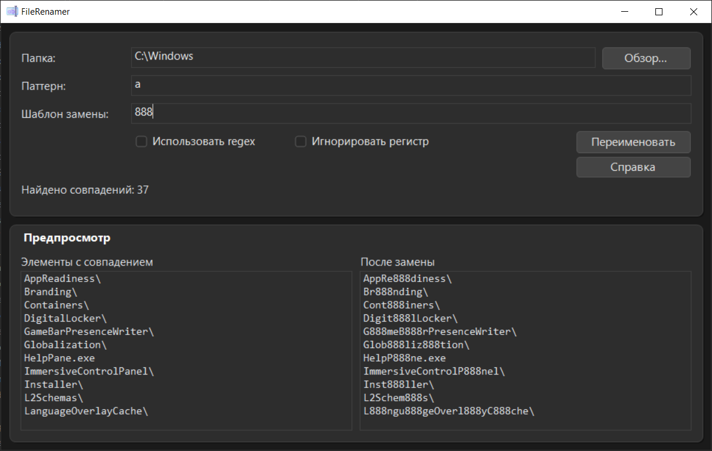

# FileRenamer

`FileRenamer` — desktop-приложение на **C++17 + WinAPI** для массового переименования файлов и папок по шаблону.

## Скриншоты



## Возможности

- Переименование по обычной строке поиска.
- Переименование по `regex` (опционально).
- Опция `Игнорировать регистр` для обычного поиска и regex.
- Поддержка **файлов и папок**.
- Кнопка `Справка` с меню:
  - `Горячие клавиши`
  - `О программе`
- Проверка и установка обновлений из окна `О программе`.
- Кастомные диалоговые окна сообщений в стиле приложения.
- Режимы при пустом поле `Паттерн`:
  - `<text` — добавить `text` в начало имени.
  - `>text` — добавить `text` в конец имени (для файлов перед расширением, для папок в конец имени).
- Двухфазное безопасное переименование (через временные имена) с откатом при ошибке.
- Предпросмотр до лимита (`PREVIEW_LIMIT`) с указанием скрытых элементов.
- Автоподстановка активного пути из Проводника Windows.

### Горячие клавиши

- `Tab` — открыть выбор папки (`Обзор...`).
- `Enter` — запустить переименование.
- Любая буква/цифра (кириллица/латиница), если фокус не в поле ввода — переводит фокус в `Паттерн` и вводит символ туда.
- `Down` в поле `Паттерн` — переход в `Шаблон замены`.
- `Up` в поле `Шаблон замены` — переход в `Паттерн`.
- `Esc` в полях ввода — снять фокус на главное окно.

## Обновления

- Проверка обновлений запускается через `Справка` -> `О программе` -> `Проверить обновления`.
- Для автообновления используется GitHub Releases репозитория `Laynholt/FileRenamer`.

## Сборка

### Требования

- Windows 10/11
- CMake 3.16+
- C++17-совместимый компилятор
- Visual Studio 2022 (MSVC) с C++ toolchain

### Команды

```powershell
cmake -S . -B build
cmake --build build --config Release
```

Готовый бинарник:

- `build/bin/Release/FileRenamer.exe`

## Использование

1. Выберите папку.
2. Заполните `Паттерн` и `Шаблон замены`.
3. При необходимости включите `regex` и/или `Игнорировать регистр`.
4. Проверьте предпросмотр.
5. Нажмите `Переименовать`.
6. При необходимости откройте `Справка` для горячих клавиш, информации о версии и обновлений.

## Лицензия

См. файл `LICENSE`.
